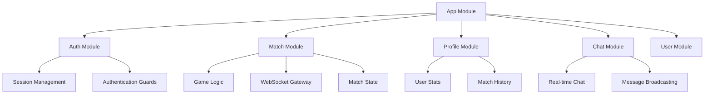

# BoomBlast

BoomBlast 是一个基于 NestJS 框架开发的在线游戏后端服务系统。

## 项目概述

本项目提供了完整的游戏后端服务，包括用户管理、匹配系统、聊天系统、排行榜等核心功能。

## 技术栈

- 框架：NestJS
- 语言：TypeScript
- 部署：Vercel
- 配置管理：环境变量（.env）

## 功能模块

### 1. 核心功能模块

#### 1.1 认证模块 (`src/modules/auth/`)
- 用户认证和授权
- JWT token 管理
- 登录/注册流程处理

#### 1.2 用户模块 (`src/modules/user/`)
- 用户账户管理
- 用户信息CRUD操作
- 用户权限管理

#### 1.3 个人资料模块 (`src/modules/profile/`)
- 用户个人资料管理
- 个人设置
- 头像和个人信息更新

#### 1.4 匹配系统 (`src/modules/match/`)
- 游戏匹配机制
- 玩家配对
- 比赛/对战记录

#### 1.5 聊天系统 (`src/modules/chat/`)
- 实时聊天功能
- 消息历史记录
- 群组聊天支持

#### 1.6 排行榜系统 (`src/modules/leaderboard/`)
- 玩家排名
- 积分统计
- 成就系统

#### 1.7 文件上传模块 (`src/modules/upload/`)
- 文件上传处理
- 文件存储管理
- 文件访问控制

#### 1.8 应用核心模块 (`src/modules/app/`)
- 应用程序配置
- 全局中间件
- 核心服务

### 2. 基础设施

#### 2.1 配置管理 (`src/config/`)
- 环境配置
- 数据库配置
- 服务配置

#### 2.2 公共库 (`src/lib/`)
- 工具函数
- 共享组件
- 通用中间件

## 项目结构

```
boomblast/
├── src/
│   ├── modules/           # 功能模块
│   │   ├── auth/         # 认证模块
│   │   ├── user/         # 用户模块
│   │   ├── profile/      # 个人资料模块
│   │   ├── match/        # 匹配系统
│   │   ├── chat/         # 聊天系统
│   │   ├── leaderboard/  # 排行榜系统
│   │   ├── upload/       # 文件上传
│   │   └── app/          # 应用核心
│   ├── config/           # 配置文件
│   ├── lib/              # 公共库
│   └── main.ts           # 应用入口
├── types/                # 类型定义
├── .env                  # 环境变量
├── .env.sample          # 环境变量示例
├── tsconfig.json        # TypeScript 配置
├── vercel.json          # Vercel 部署配置
└── package.json         # 项目依赖
```

## 开发指南

### 环境要求
- Node.js >= 14
- pnpm

### 安装依赖
```bash
pnpm install
```

### 开发环境运行
```bash
pnpm run start:dev
```

### 构建
```bash
pnpm run build
```

### 生产环境运行
```bash
pnpm run start:prod
```

## 环境变量配置

请参考 `.env.sample` 文件配置必要的环境变量：
- 复制 `.env.sample` 为 `.env`
- 填写相应的配置项

## 部署

项目支持通过 Vercel 进行部署，配置文件位于 `vercel.json`。

## 贡献指南

1. Fork 本仓库
2. 创建特性分支
3. 提交更改
4. 发起 Pull Request

## 许可证

[MIT License](LICENSE)

# Exploding Kittens API 模块文档

## 模块概述

API模块是Exploding Kittens游戏的服务端实现。采用NestJS框架构建,实现了完整的游戏服务端功能,包括:
- 用户认证和会话管理
- 实时游戏逻辑处理
- 数据持久化
- WebSocket通信
- 排行榜系统
- 用户档案管理
- 聊天系统

## 核心模块

### 1. App Module (`/modules/app`)
- 应用程序的根模块
- 负责整合所有子模块
- 配置数据库连接、Redis连接和WebSocket适配器
- 提供基础的健康检查接口

### 2. Auth Module (`/modules/auth`)
- 处理用户认证相关功能
- 实现会话管理中间件
- 提供HTTP和WebSocket的认证守卫
- 管理用户登录状态

### 3. Match Module (`/modules/match`)
- 游戏核心模块
- 实现游戏逻辑和规则
- 管理实时对局状态
- 处理玩家操作和游戏事件
- 维护排位系统

### 4. Profile Module (`/modules/profile`)
- 用户档案管理
- 处理用户数据展示
- 管理用户统计信息
- 提供玩家历史记录查询

### 5. Chat Module (`/modules/chat`)
- 实时聊天功能
- 支持对局内通信
- 实现基于WebSocket的消息广播
- 管理聊天室和私聊

## 技术架构



## 核心功能实现

### 1. WebSocket通信
```typescript
// WebSocket适配器配置
@WebSocketGateway()
export class AppGateway implements OnGatewayInit {
  afterInit(server: Server): void {
    server.use(async (socket, next) => {
      // 集成Session中间件
      const middleware = session(this.redis);
      // ... 会话处理逻辑
    });
  }
}
```

### 2. 数据库连接
```typescript
// 数据库配置
TypeOrmModule.forRootAsync({
  imports: [ConfigModule],
  useFactory: (config: ConfigService) => ({
    type: "postgres",
    host: config.get("db.host"),
    // ... 数据库连接配置
  })
})
```

### 3. Redis缓存
```typescript
// Redis配置
RedisModule.forRootAsync({
  imports: [ConfigModule],
  useFactory: (config: ConfigService) => ({
    host: config.get("redis.host"),
    // ... Redis连接配置
  })
})
```

## 性能优化

1. **集群支持**
   - 使用Redis存储共享状态
   - 实现无状态设计
   - 支持多实例部署

2. **内存管理**
   - 及时清理无用连接
   - 使用Redis缓存活跃游戏
   - 实现自动垃圾回收

3. **并发处理**
   - 使用WebSocket实现实时通信
   - 采用队列处理密集操作
   - 实现乐观锁防止并发冲突

## 安全措施

1. **认证与授权**
   - Session基认证
   - 路由保护
   - WebSocket连接验证

2. **数据验证**
   - 输入验证
   - 参数净化
   - 类型检查

3. **错误处理**
   - 全局异常过滤器
   - 日志记录
   - 错误响应格式化

## 部署说明

1. **环境要求**
   ```
   Node.js >= 14
   PostgreSQL >= 12
   Redis >= 6
   ```

2. **环境变量**
   ```
   DATABASE_URL=postgresql://...
   REDIS_URL=redis://...
   SESSION_SECRET=...
   CLIENT_ORIGIN=...
   ```

3. **启动命令**
   ```bash
   # 开发环境
   npm run dev
   
   # 生产环境
   npm run build
   npm run start:prod
   ```

## 代码规范

1. **文件组织**
   - 模块化结构
   - 清晰的职责划分
   - 统一的命名规范

2. **代码风格**
   - 使用TypeScript
   - 遵循SOLID原则
   - 编写单元测试

3. **文档要求**
   - 注释关键逻辑
   - 更新API文档
   - 维护更新日志

## 监控与日志

1. **性能监控**
   - 请求响应时间
   - WebSocket连接数
   - 内存使用情况

2. **错误追踪**
   - 异常捕获
   - 错误上报
   - 状态码统计

3. **业务统计**
   - 活跃用户数
   - 对局场次
   - 系统负载
