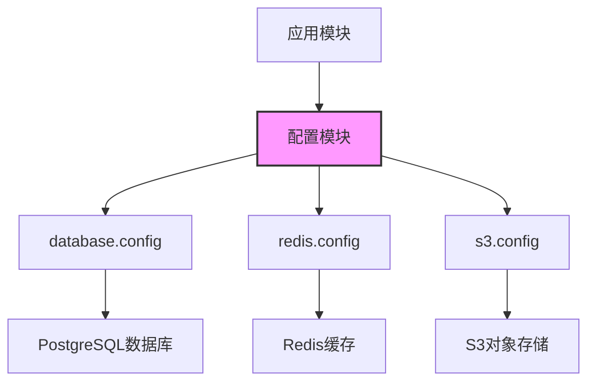

# 配置模块

## 模块概述

配置模块为Exploding Cats GameFi应用提供集中化的配置管理，负责处理与外部服务的连接参数。该模块通过环境变量读取各种服务配置，确保应用在不同环境中能够正确连接到所需的基础设施。

## 核心功能

- **环境变量管理**：从进程环境中读取配置参数，实现配置与代码分离
- **数据库连接配置**：提供PostgreSQL数据库的连接参数与SSL设置
- **Redis连接配置**：支持Redis缓存服务的连接与重试策略
- **S3存储配置**：管理对象存储服务的访问凭证与区域设置
- **统一导出接口**：提供单一入口点访问所有配置项，方便模块间引用

## 关键组件

### 配置文件

- **index.ts**: 统一导出所有配置模块，作为配置的主入口点
- **database.config.ts**: 定义PostgreSQL数据库连接配置，包含SSL安全连接设置
- **redis.config.ts**: 管理Redis缓存服务连接参数，实现了自动重连机制
- **s3.config.ts**: 配置S3兼容对象存储服务的访问凭证与终端节点

## 依赖关系

### 内部依赖
- **@nestjs/config**: 利用NestJS的配置管理模块实现配置注册与命名空间隔离

### 外部服务依赖
- **PostgreSQL数据库**: 游戏数据的持久化存储
- **Redis缓存**: 提供会话管理与临时数据缓存
- **S3对象存储**: 存储游戏资源与用户上传内容

## 使用示例

```typescript
// 在其他模块中导入并使用配置
import { ConfigModule, ConfigService } from '@nestjs/config';
import { databaseConfig, redisConfig, s3Config } from '../config';

@Module({
  imports: [
    ConfigModule.forRoot({
      load: [databaseConfig, redisConfig, s3Config],
    }),
    TypeOrmModule.forRootAsync({
      inject: [ConfigService],
      useFactory: (configService: ConfigService) => configService.get('db'),
    }),
  ],
})
export class AppModule {}
```

## 架构说明

配置模块采用NestJS的`registerAs`方法实现命名空间隔离，每个服务配置都有自己的命名空间（如'db', 'redis', 's3'）。这种设计确保了配置的模块化和可维护性。所有配置都通过环境变量注入，遵循基础设施即代码(IaC)的最佳实践。

配置模块处于应用的最底层，被所有需要外部服务连接的模块所依赖，是整个应用的基础组件之一。



本模块使用环境变量进行配置，确保在开发、测试和生产环境中都能灵活配置外部服务连接参数，同时保持代码的一致性和安全性。
