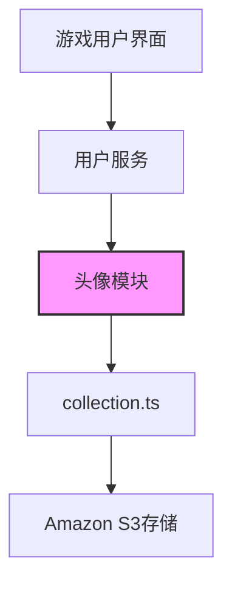

# 头像模块

## 模块概述

头像模块负责管理Exploding Cats GameFi中玩家头像资源的集合与访问。该模块提供了一系列预定义的头像URL，使游戏能够为玩家配置个性化的视觉标识，增强用户体验和社交互动。

## 核心功能

- **头像资源管理**：集中管理游戏中可用的所有头像资源
- **S3链接集成**：通过S3存储服务提供头像资源的远程访问
- **头像URL列表**：提供统一的头像URL集合，方便在应用中引用
- **简化接口**：通过单一导出点简化头像资源的访问方式

## 关键组件

### 头像文件

- **index.ts**: 主入口文件，导出头像集合，提供统一的访问接口
- **collection.ts**: 定义所有可用头像的URL列表，指向S3存储中的实际资源文件

## 依赖关系

### 外部依赖
- **Amazon S3服务**: 用于存储和提供头像图片资源，确保资源的可用性和可扩展性

### 内部依赖
- **config/s3.config.ts**: 间接依赖S3配置，头像资源存储位于S3服务中

## 使用示例

```typescript
// 在用户服务中引入头像集合
import { avatars } from '../lib/avatars';

@Injectable()
export class UserService {
  // 为新用户随机分配头像
  assignRandomAvatar(): string {
    const randomIndex = Math.floor(Math.random() * avatars.length);
    return avatars[randomIndex];
  }
  
  // 根据用户喜好选择特定头像
  selectAvatar(index: number): string {
    if (index < 0 || index >= avatars.length) {
      throw new BadRequestException('头像索引无效');
    }
    return avatars[index];
  }
}
```

## 架构说明

头像模块采用了简单而高效的设计，通过引用远程S3存储中的资源，避免了在应用代码中直接包含大量图片资源的需要。这种设计有以下优势：

1. 减少应用包体积，提高部署速度
2. 支持在不重新部署应用的情况下更新头像资源
3. 利用S3服务的高可用性和CDN功能提供全球快速访问

模块的演进历史可见于注释掉的代码，最初设计是直接从本地文件系统读取头像资源，后来优化为使用远程S3链接。



头像模块虽然结构简单，但在游戏的个性化体验中扮演重要角色，为玩家提供身份标识，增强游戏的社交和竞争元素。
