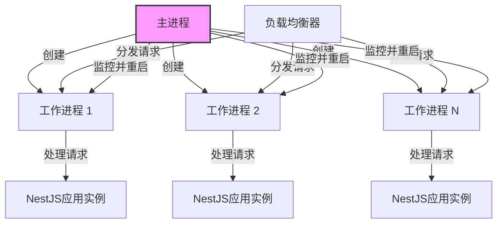

# 集群模块

## 模块概述

集群模块实现了Exploding Cats GameFi应用的多进程扩展能力，通过Node.js原生的cluster机制在生产环境中自动利用多核CPU资源。该模块提供了一种优雅的方式来提高应用的并发处理能力和可用性。

## 核心功能

- **多进程扩展**: 基于CPU核心数自动创建多个工作进程
- **环境感知**: 智能区分生产和开发环境，仅在生产环境启用集群
- **故障恢复**: 实现工作进程崩溃后的自动重启机制
- **简化API**: 提供简洁的clusterize函数封装复杂的集群逻辑

## 关键组件

### 集群文件

- **index.ts**: 定义并导出clusterize函数，管理主进程和工作进程的创建与协调

## 依赖关系

### 内部依赖
- **../types**: 引用Callback类型定义，用于函数参数类型标注

### 外部依赖
- **Node.js cluster模块**: 提供多进程管理的核心功能
- **Node.js os模块**: 用于获取系统CPU信息以确定工作进程数量

## 使用示例

```typescript
// 在应用主入口文件中使用集群功能
import { NestFactory } from '@nestjs/core';
import { AppModule } from './app.module';
import { clusterize } from './lib/cluster';

async function bootstrap() {
  const app = await NestFactory.create(AppModule);
  await app.listen(3000);
  console.log('应用已启动在端口3000');
}

// 使用集群模块包装启动函数
clusterize(() => {
  bootstrap().catch(err => {
    console.error('应用启动失败:', err);
    process.exit(1);
  });
});
```

## 架构说明

集群模块实现了主-工作进程模式，这是一种常见的Node.js应用扩展模式。在这种模式下：

1. 主进程负责创建和管理工作进程
2. 工作进程负责处理实际的客户端请求
3. 系统自动使用轮询方式在多个工作进程间分发请求

该设计利用了操作系统的负载均衡能力，在不修改应用代码的情况下提高了整体性能和可靠性。



该模块通过环境变量`NODE_ENV`判断当前运行环境，仅在生产环境中启用集群功能，保持开发环境的简洁性和调试便利性。在工作进程崩溃时，主进程会立即创建新的工作进程，确保系统的高可用性和弹性。
