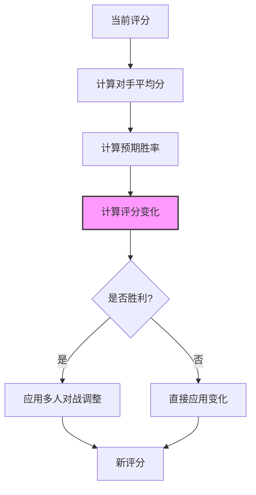

# Elo评分模块

## 模块概述

Elo评分模块实现了Exploding Cats GameFi中的玩家技能评分系统，基于经典的Elo等级分系统进行改良，用于计算和更新玩家在对战后的技能评分。该模块特别适配了多人游戏场景，支持一对多的评分计算。

## 核心功能

- **胜负评分计算**: 根据对战结果计算玩家新的评分
- **多人对战支持**: 支持一名玩家对战多名对手的情况
- **评分调整系统**: 实现基于对手数量的评分调整机制
- **预期分数计算**: 计算基于当前评分差异的预期胜率

## 关键组件

### 评分系统文件

- **index.ts**: 实现Elo评分算法的核心逻辑，包含评分计算和调整函数

## 关键参数

- **PERF**: 400 (性能常数，用于计算预期分数)
- **K_FACTOR**: 70 (K因子，决定评分变化的幅度)
- **胜负分值**:
  - 胜利 = 1.0
  - 失败 = 0.0

## 使用示例

```typescript
import { elo } from '../lib/elo';

// 计算胜利情况下的新评分
const currentRating = 1500;
const opponentRatings = [1400, 1450, 1600];
const newRating = elo.ifWon(currentRating, opponentRatings);

// 计算失败情况下的新评分
const lostRating = elo.ifLost(currentRating, opponentRatings);

// 评分调整示例
const shiftAmount = 25;
const opponentsCount = 3;
const adjustedShift = elo.adjust(shiftAmount, opponentsCount);
```

## 架构说明

Elo评分系统采用了改良版的计算方法，特别考虑了多人对战的场景：

1. 计算对手的平均评分
2. 基于评分差计算预期胜率
3. 根据实际结果和预期结果的差异计算评分变化
4. 在胜利情况下，根据对手数量进行额外调整



### 评分计算公式

1. **预期分数计算**:
   ```
   E = 1 / (1 + 10^((对手评分 - 当前评分) / PERF))
   ```

2. **评分变化计算**:
   ```
   评分变化 = K * (实际分数 - 预期分数)
   ```

3. **多人对战调整**:
   ```
   最终变化 = 评分变化 * 对手数量 (仅在胜利时应用)
   ```

这种设计确保了评分系统能够:
- 准确反映玩家的实际技能水平
- 对多人对战场景给予合理的评分调整
- 保持系统的平衡性和可预测性
