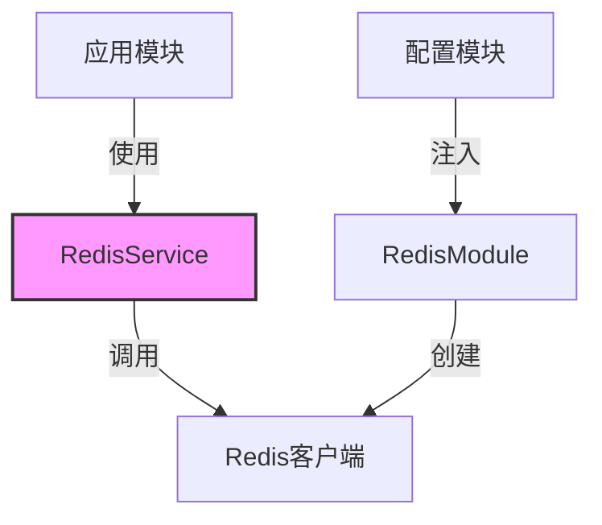

# Redis服务模块

## 模块概述

Redis服务模块为Exploding Cats GameFi提供了统一的Redis访问层，封装了Redis操作的复杂性，提供了类型安全的数据访问接口。该模块作为应用的基础设施，支持游戏状态管理、缓存和实时数据同步。

## 核心功能

- **类型安全操作**: 提供泛型支持的数据存取接口
- **动态模块注入**: 支持异步配置加载和动态模块注册
- **JSON序列化**: 自动处理数据的序列化和反序列化
- **前缀管理**: 统一的键前缀管理，避免键名冲突

## 关键组件

### 模块文件
- **redis.module.ts**: 实现动态模块注册和Redis客户端配置
- **redis.service.ts**: 提供高级Redis操作接口
- **redis.decorator.ts**: 提供Redis客户端注入装饰器
- **lib/constants.ts**: 定义Redis键前缀和常量
- **lib/typings.ts**: 定义模块相关的类型定义

## 依赖关系

### 内部依赖
- **config/redis.config.ts**: Redis连接配置

### 外部依赖
- **ioredis**: Redis客户端库
- **@nestjs/common**: NestJS核心功能

## 使用示例

```typescript
// 模块注册示例
import { RedisModule } from './lib/redis';
import { ConfigModule, ConfigService } from '@nestjs/config';

@Module({
  imports: [
    RedisModule.forRootAsync({
      imports: [ConfigModule],
      inject: [ConfigService],
      useFactory: (config: ConfigService) => ({
        host: config.get('REDIS_HOST'),
        port: config.get('REDIS_PORT'),
        password: config.get('REDIS_PASSWORD'),
      }),
    }),
  ],
})
export class AppModule {}

// 服务使用示例
@Injectable()
export class GameService {
  constructor(private readonly redisService: RedisService) {}

  async saveGameState(gameId: string, state: GameState) {
    const key = `${RP.MATCH}:${gameId}`;
    await this.redisService.set(key, state);
  }

  async getGameState(gameId: string): Promise<GameState | null> {
    const key = `${RP.MATCH}:${gameId}`;
    return this.redisService.get<GameState>(key);
  }
}
```

## 架构说明

Redis模块采用了分层设计模式：

1. **模块层**: 负责Redis客户端的初始化和注入
2. **服务层**: 提供高级操作接口
3. **工具层**: 提供常量和类型定义



### 键前缀系统

模块使用统一的前缀系统管理不同类型的数据：
- MATCH: 游戏匹配相关数据
- QUEUE: 队列相关数据
- LOBBY: 大厅相关数据
- USER: 用户相关数据

### 性能优化

- 使用连接池管理Redis连接
- 实现重试策略处理连接失败
- JSON序列化优化

### 类型安全

通过TypeScript泛型实现了类型安全的数据访问：
```typescript
async get<T>(key: string): Promise<T | null>
async set<T>(key: string, value: T): Promise<void>
async update<T>(key: string, partial: Partial<T>): Promise<void>
```

这样的设计确保了:
- 数据操作的类型安全
- 代码的可维护性
- 开发体验的提升
