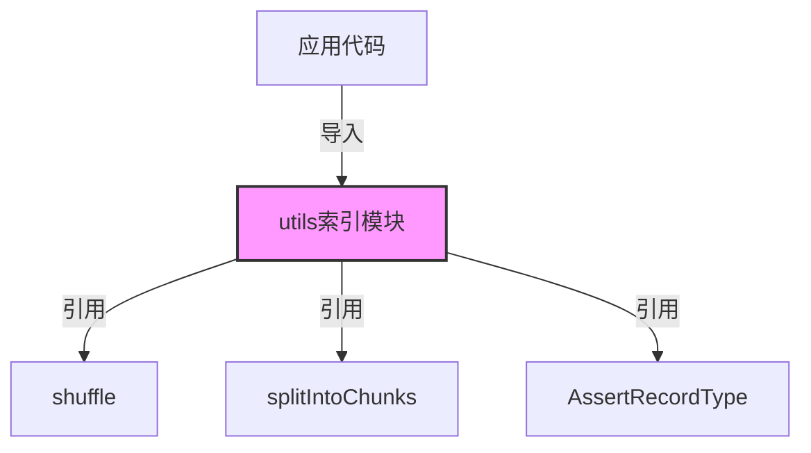

# 工具模块

## 模块概述

工具模块为Exploding Cats GameFi提供了一系列通用工具函数，包括数组操作、类型检查等实用功能。这些工具函数在整个应用中被广泛使用，提高了代码的复用性和可维护性。

## 核心功能

- **数组洗牌**: 实现Fisher-Yates洗牌算法
- **数组分块**: 将大数组分割成指定大小的子数组
- **类型断言**: 提供类型安全的运行时类型检查工具
- **工具集中管理**: 统一导出所有工具函数，方便使用

## 关键组件

### 工具函数文件

- **index.ts**: 统一导出所有工具函数
- **shuffle.ts**: 实现数组随机洗牌功能
- **split-into-chunks.ts**: 实现数组分块功能
- **assert-record-type.ts**: 实现类型断言功能

## 使用示例

```typescript
import { utils } from '../lib/utils';

// 洗牌示例
const cards = [1, 2, 3, 4, 5];
const shuffledCards = utils.shuffle(cards);

// 数组分块示例
const items = [1, 2, 3, 4, 5, 6, 7, 8];
const chunks = utils.splitIntoChunks(items, 3);
// 结果: [[1,2,3], [4,5,6], [7,8]]

// 类型断言示例
const data = { id: 1, name: 'Card' };
utils.AssertRecordType(data, ['id', 'name']);
```

## 架构说明

工具模块采用了功能分离的设计原则，每个工具函数都是独立的，但通过统一的入口点导出：



### 工具函数说明

1. **shuffle**
   - 实现Fisher-Yates洗牌算法
   - 保证随机性和性能
   - 不修改原数组

2. **splitIntoChunks**
   - 支持任意类型数组
   - 自动处理边界情况
   - 保持原数据顺序

3. **AssertRecordType**
   - 运行时类型检查
   - 支持嵌套对象
   - 抛出类型错误异常

### 最佳实践

- 所有工具函数都是纯函数
- 避免修改输入参数
- 提供类型安全的接口
- 保持函数简单和单一职责
- 详细的错误提示

这些工具函数广泛应用于：
- 游戏卡牌的洗牌
- 批量数据处理
- API响应数据验证
- 游戏状态管理
