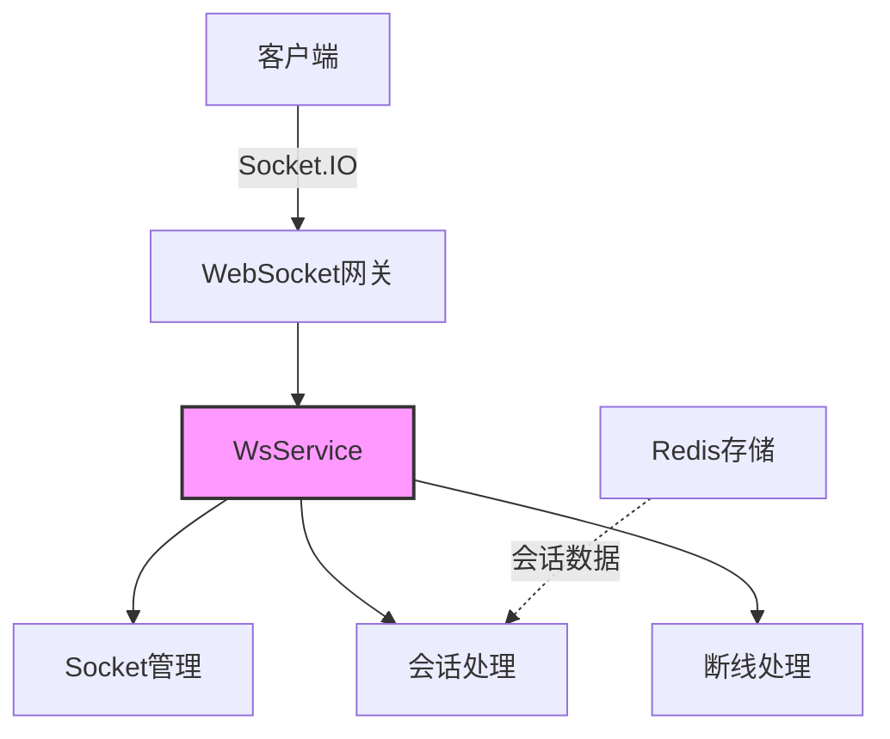

# WebSocket模块

## 模块概述

WebSocket模块为Exploding Cats GameFi提供实时通信基础设施，处理玩家间的实时交互、游戏状态同步和事件通知。该模块基于Socket.IO构建，提供了可靠的双向通信能力。

## 核心功能

- **Socket管理**: 维护和管理WebSocket连接生命周期
- **会话集成**: 与Express会话系统无缝集成
- **房间管理**: 支持基于房间的消息广播和分组通信
- **断线处理**: 提供完善的断线重连和清理机制
- **类型安全**: 提供TypeScript类型支持的通信接口

## 关键组件

### 核心服务
- **ws.service.ts**: 提供WebSocket连接管理的核心服务
- **ws.adapter.ts**: 实现NestJS的WebSocket适配器

### 工具和装饰器
- **ws-session.decorator.ts**: 提供WebSocket会话访问装饰器
- **ack.ts**: 处理WebSocket确认回调的工具函数

## 依赖关系

### 内部依赖
- **redis模块**: 用于存储会话数据
- **config模块**: 提供WebSocket配置

### 外部依赖
- **socket.io**: WebSocket服务器实现
- **@nestjs/websockets**: NestJS的WebSocket集成
- **express-session**: 会话管理

## 使用示例

```typescript
// WebSocket网关示例
@WebSocketGateway()
export class GameGateway {
  constructor(private readonly wsService: WsService) {}

  @SubscribeMessage('joinGame')
  async handleJoinGame(
    @ConnectedSocket() socket: Socket,
    @WsSession() session: any,
    @MessageBody() data: JoinGameDto
  ) {
    // 处理加入游戏逻辑
    const userId = session.user.id;
    await this.wsService.setupDisconnectHandler(
      socket,
      userId,
      () => this.handleDisconnect(socket),
      'game'
    );
  }
}
```

## 架构说明

WebSocket模块采用分层架构设计：



### 关键特性

1. **实例管理**:
   - 支持多实例追踪
   - 独立的实例日志
   - 资源自动清理

2. **连接生命周期**:
   - 连接建立验证
   - 会话绑定
   - 断线事件处理
   - 资源回收

3. **性能优化**:
   - 监听器限制管理
   - 内存泄漏防护
   - 批量操作优化

### 最佳实践

- 使用`WsSession`装饰器访问会话数据
- 正确处理断线重连场景
- 及时清理不需要的事件监听器
- 使用房间功能进行分组通信
