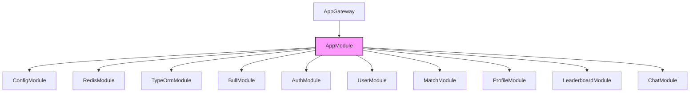

# 应用根模块

## 模块概述

应用根模块(AppModule)是Exploding Cats GameFi的核心模块，负责整合所有子系统并提供应用的基础设施配置。该模块实现了数据库连接、Redis缓存、消息队列等基础服务的初始化和配置。

## 核心功能

- **模块集成**: 统一管理和配置所有子模块
- **基础设施配置**: 处理数据库、缓存、消息队列等配置
- **WebSocket网关**: 提供实时通信基础设施
- **健康检查**: 提供API健康状态监控端点

## 关键组件

### 主要文件
- **app.module.ts**: 应用主模块，集成所有子系统
- **app.gateway.ts**: WebSocket网关，处理实时通信
- **index.ts**: 模块导出文件

### 集成的模块
- AuthModule: 认证模块
- UserModule: 用户管理
- MatchModule: 游戏匹配
- ProfileModule: 用户档案
- LeaderboardModule: 排行榜
- ChatModule: 聊天系统

## 依赖关系

### 外部依赖
- **@nestjs/common**: NestJS核心功能
- **@nestjs/config**: 配置管理
- **@nestjs/typeorm**: 数据库ORM
- **@nestjs/bull**: 消息队列
- **socket.io**: WebSocket服务

### 内部依赖
- **config模块**: 配置管理
- **redis模块**: Redis客户端
- **session模块**: 会话管理

## 使用示例

```typescript
// 启动应用
import { NestFactory } from '@nestjs/core';
import { AppModule } from './modules/app';

async function bootstrap() {
  const app = await NestFactory.create(AppModule);
  
  // 配置全局中间件
  app.enableCors({
    origin: process.env.CLIENT_ORIGIN,
    credentials: true
  });
  
  await app.listen(3000);
}

bootstrap();
```

## 架构说明

应用模块采用模块化设计，通过依赖注入实现松耦合：



### 配置要点

1. **数据库配置**:
   - PostgreSQL连接
   - SSL安全连接
   - 自动同步实体

2. **Redis配置**:
   - TLS安全连接
   - 会话存储
   - 缓存管理

3. **Bull队列配置**:
   - Redis持久化
   - 任务调度
   - 错误处理

4. **WebSocket配置**:
   - CORS策略
   - 会话集成
   - 实时通信

### 模块职责

- **配置管理**: 统一管理环境变量和配置信息
- **数据持久化**: 处理数据库连接和ORM配置
- **缓存管理**: 配置Redis缓存服务
- **消息队列**: 设置Bull队列系统
- **实时通信**: 配置WebSocket网关
- **健康监控**: 提供健康检查接口
