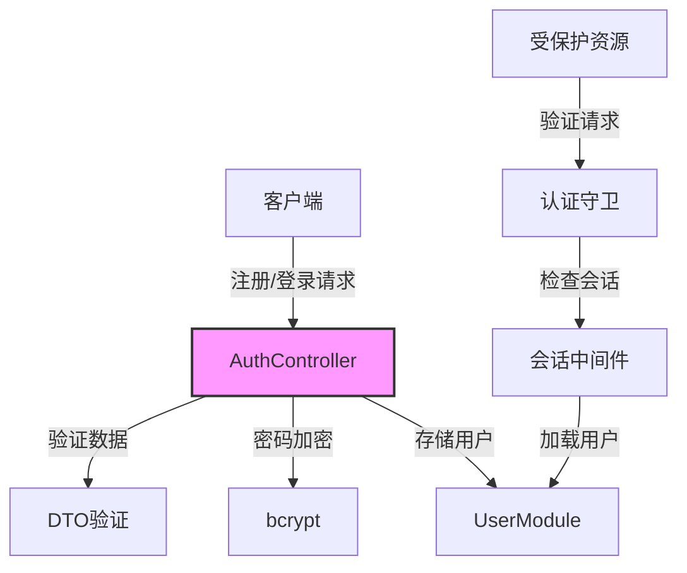

# 认证模块

## 模块概述

认证模块负责Exploding Cats GameFi的用户认证与授权管理，提供用户注册、登录、会话管理等核心功能。该模块通过中间件和守卫确保系统的安全性。

## 核心功能

- **用户注册**: 支持新用户注册并自动分配头像
- **用户认证**: 处理用户登录和密码验证
- **会话管理**: 维护用户会话状态
- **访问控制**: 通过守卫保护API端点
- **用户名验证**: 提供用户名可用性检查

## 关键组件

### 控制器
- **auth.controller.ts**: 处理认证相关的HTTP请求
- **auth.middleware.ts**: 用户会话中间件
- **guards/**: HTTP和WebSocket的认证守卫

### 数据传输对象（DTO）
- **login.dto.ts**: 登录请求验证
- **register.dto.ts**: 注册请求验证
- **verify-username.dto.ts**: 用户名验证

## 依赖关系

### 内部依赖
- **UserModule**: 用户数据管理
- **UploadModule**: 文件上传服务
- **lib/avatars**: 头像资源管理

### 外部依赖
- **bcryptjs**: 密码加密
- **class-validator**: 请求数据验证
- **express-session**: 会话管理

## 使用示例

```typescript
// 控制器使用示例
@Controller()
class GameController {
  @UseGuards(IsAuthenticatedViaHttpGuard)
  @Get('/profile')
  async getProfile(@Session() session: SessionWithData) {
    return session.user;
  }
}

// WebSocket守卫使用示例
@WebSocketGateway()
class GameGateway {
  @UseGuards(IsAuthenticatedViaWsGuard)
  @SubscribeMessage('joinGame')
  handleJoinGame() {
    // 处理已认证用户的游戏加入请求
  }
}
```

## 架构说明

认证流程和数据流：



### 安全特性

1. **密码安全**:
   - bcrypt加密
   - 密码长度验证
   - 安全的密码存储

2. **会话管理**:
   - 安全的会话存储
   - 会话超时控制
   - 防止会话劫持

3. **输入验证**:
   - 严格的DTO验证
   - XSS防护
   - SQL注入防护

### 错误处理

```typescript
// 统一的错误响应格式
{
  ok: false,
  msg: string,
  errors?: ValidationError[]
}
```

所有认证相关的错误都会返回适当的HTTP状态码和错误消息，确保客户端能够正确处理认证失败的情况。
