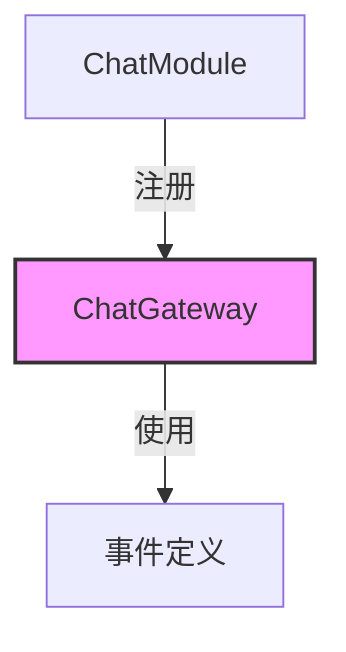

# 聊天模块

## 模块概述

聊天模块提供了Exploding Cats GameFi的实时通信功能，实现了基本的聊天消息传递系统。该模块采用WebSocket技术，支持游戏内的即时通讯需求。

## 核心功能

- **消息发送**: 支持 `chat:send-message` 事件
- **聊天室加入**: 支持 `chat:join-chat` 事件
- **消息广播**: 通过 `chat:new-message` 事件推送新消息

## 关键组件

### 核心文件
- **chat.module.ts**: 声明聊天模块及其依赖
- **chat.gateway.ts**: WebSocket网关实现
- **lib/events.ts**: 定义所有聊天相关事件

## 事件定义

```typescript
const events = {
  server: {
    SEND_MESSAGE: "chat:send-message",
    JOIN_CHAT: "chat:join-chat",
  },
  client: {
    NEW_MESSAGE: "chat:new-message",
  },
};
```

## 模块结构



## 使用示例

```typescript
// 客户端连接示例
socket.on('chat:new-message', (message) => {
  console.log('收到新消息:', message);
});

// 发送消息
socket.emit('chat:send-message', {
  content: '你好!'
});

// 加入聊天
socket.emit('chat:join-chat', {
  roomId: 'game-123'
});
```

## 技术说明

- 使用Socket.IO作为WebSocket实现
- 事件前缀统一为"chat:"
- 支持服务端和客户端双向事件
