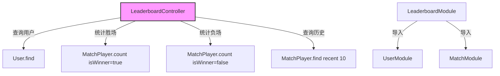

# 排行榜模块

## 模块概述

排行榜模块负责Exploding Cats GameFi的玩家排名系统，提供基于玩家评分(rating)的排名数据，并结合胜率和最近比赛历史记录展示玩家的竞技表现。

## 核心功能

- **评分排名**: 基于玩家rating降序排列
- **胜率统计**: 计算每个玩家的胜率百分比
- **战绩历史**: 显示玩家最近10场比赛的胜负记录
- **综合数据**: 整合玩家基础信息与竞技数据

## 关键组件

### 文件结构
- **leaderboard.module.ts**: 排行榜模块配置与依赖注入
- **leaderboard.controller.ts**: 处理排行榜数据查询请求
- **index.ts**: 模块导出

## 接口定义

### GET /leaderboard
返回所有玩家的排名数据，包含：
- 玩家基本信息
- 胜率数据
- 最近10场比赛记录

响应格式:
```typescript
{
  leaderboard: Array<{
    id: string;
    username: string;
    avatar: string;
    rating: number;
    winrate: number;
    history: Array<"victory" | "defeat">;
  }>
}
```

## 依赖关系

### 内部依赖
- **UserModule**: 提供用户基础数据
- **MatchModule**: 提供比赛记录数据

### 数据模型
- **User**: 用户实体，提供rating数据
- **MatchPlayer**: 比赛玩家记录，提供胜负数据

## 实现细节



### 数据计算逻辑

1. **胜率计算**:
   ```typescript
   winrate = played ? Math.ceil((won / played) * 100) : 0
   ```

2. **历史记录**:
   - 获取最近10场比赛
   - 按时间降序排序
   - 转换为victory/defeat记录

### 性能考虑

- 使用TypeORM的count查询优化统计
- 限制历史记录查询数量为10条
- 使用降序索引优化排名查询
