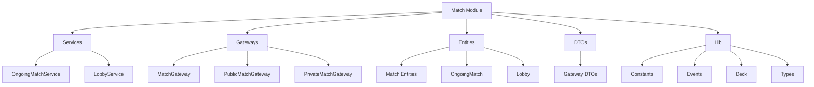
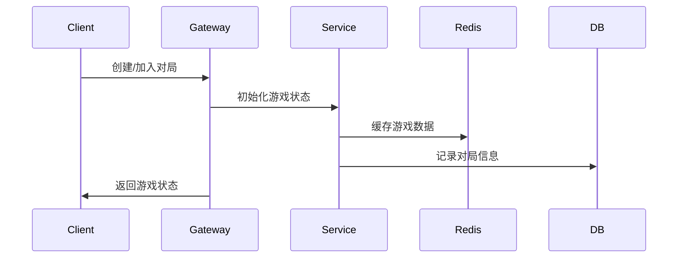
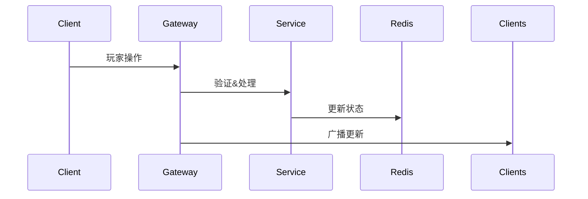

# Match Module - Exploding Kittens Game Core

## 模块概述

Match模块是Exploding Kittens游戏的核心实现，负责处理游戏的所有核心逻辑，包括:
- 游戏状态管理(匹配、对局、结算)
- 实时游戏服务(WebSocket通信)
- 数据持久化(Redis+PostgreSQL)
- 玩家行为处理(出牌、抽牌等)
- 排位系统(ELO积分)

## 核心功能

### 1. 游戏状态管理
- **匹配系统**: 提供公共匹配队列和私人对局创建
- **对局管理**: 处理游戏进程、回合制、状态同步
- **数据持久化**: 使用Redis缓存活跃游戏，PostgreSQL存储历史记录
- **实时通信**: 基于Socket.io的双向实时通信
- **排位系统**: 基于ELO算法的积分计算和排名

### 2. 游戏逻辑实现
- **卡牌系统**: 包含所有卡牌效果和连锁反应
- **回合制**: 处理玩家轮换和攻击轮次
- **特殊效果**: 实现爆炸猫、未来视等机制
- **观战系统**: 支持实时观战和回放
- **超时处理**: 使用Bull队列处理超时和自动认输

## 模块架构



## 核心组件

### 1. Services 层
```typescript
// 游戏服务示例
@Injectable()
export class OngoingMatchService {
  // 获取进行中的游戏
  async get(id: string): Promise<OngoingMatch> {
    const data = await this.redisService.get<OngoingMatchData>(`match:${id}`);
    return new OngoingMatch(data);
  }
  
  // 保存游戏状态
  async save(match: OngoingMatch): Promise<void> {
    await this.redisService.set(`match:${match.id}`, match);
  }
}
```

### 2. Gateway 层
```typescript
// WebSocket处理示例
@WebSocketGateway()
export class MatchGateway {
  @SubscribeMessage('play-card')
  async playCard(
    @ConnectedSocket() socket: Socket,
    @MessageBody() dto: PlayCardDto
  ): Promise<WsResponse> {
    const match = await this.matchService.get(dto.matchId);
    await this.handleCardAction(match, dto.card);
    return ack({ok: true});
  }
}
```

### 3. Entities 层
```typescript
// 游戏实体示例
export class OngoingMatch {
  id: string;
  players: OngoingMatchPlayer[];
  draw: Card[];
  discard: Card[];
  state: OngoingMatchState;
  
  public changeTurn() {
    if (this.context.reversed) {
      // 处理反转逻辑
    }
    // 正常回合推进
  }
}
```

## 数据流

### 1. 对局创建流程


### 2. 游戏进行流程


## 关键实现细节

### 1. 状态同步
- 使用Redis存储实时游戏状态
- 通过WebSocket广播状态更新
- 实现乐观锁防止并发冲突

### 2. 超时处理
```typescript
// 超时配置示例
export const QUEUE = {
  INACTIVITY: {
    NAME: "inactivity",
    DELAY: {
      COMMON: 45000,   // 普通行动
      DEFUSE: 10000    // 拆弹时间
    }
  }
}
```

### 3. 错误处理
```typescript
try {
  await this.handleCardAction(match, card);
} catch (error) {
  // 1. 记录错误
  this.logger.error(error);
  // 2. 恢复状态
  await this.recoverMatchState(match);
  // 3. 通知客户端
  return ack({ok: false, error: error.message});
}
```

## 性能优化

1. **缓存策略**
   - 使用Redis存储活跃游戏
   - 实现多级缓存
   - 定期清理过期数据

2. **并发控制**
   - 使用乐观锁
   - 原子性操作
   - 队列处理超时

3. **数据压缩**
   - 最小化传输数据
   - 增量更新
   - WebSocket数据压缩

## 配置项

```typescript
export const MATCH_CONFIG = {
  // 玩家限制
  MAX_PLAYERS: 10,
  MIN_PLAYERS: 2,
  
  // 初始卡牌
  INITIAL_CARDS: 4,
  
  // 超时设置
  TIMEOUTS: {
    TURN: 45000,
    DEFUSE: 10000,
    QUEUE: 5000
  }
}
```

## 使用示例

```typescript
// 1. 创建对局
const match = new OngoingMatch({
  id: nanoid(),
  players: generatePlayers(participants),
  draw: deck.generate(playerCount),
  state: { type: MATCH_STATE.WFA }
});

// 2. 处理玩家行动
@SubscribeMessage('play-card')
async handlePlayCard(socket: Socket, dto: PlayCardDto) {
  const match = await this.matchService.get(dto.matchId);
  await this.validateAction(match, socket.user);
  await this.executeCardEffect(match, dto.card);
  this.broadcastState(match);
}

// 3. 结算游戏
async handleGameEnd(match: OngoingMatch) {
  const winner = match.players[0];
  await this.calculateElo(match);
  await this.recordMatchResult(match);
  this.broadcastGameEnd(match);
}
```
