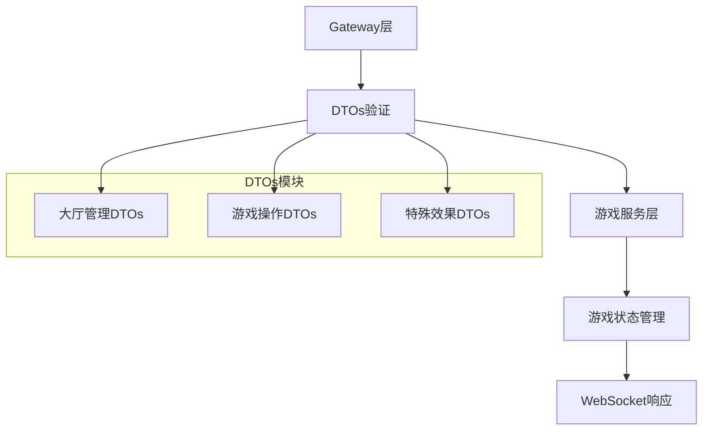

# Gateway DTOs Module

## Module Overview

Gateway DTOs模块是Exploding Cats GameFi中负责处理游戏内各类操作请求的数据传输对象(DTO)集合。该模块定义了所有与游戏逻辑相关的输入验证和数据结构，包括游戏大厅管理、卡牌操作、玩家行为等核心功能。

## Core Functionality

- **游戏大厅管理**: 处理玩家加入/离开大厅、更改游戏模式等操作
- **对局操作**: 处理抽卡、出牌、使用技能等游戏核心玩法
- **玩家互动**: 管理观战、邀请好友、踢出玩家等社交功能
- **特殊卡牌效果**: 处理爆炸猫卡、未来视、埋牌等特殊卡牌效果
- **游戏流程控制**: 处理开始游戏、跳过回合等游戏流程

## Key Components

### 大厅管理DTOs
- **join-as-player.dto.ts**: 玩家身份加入大厅
- **leave-lobby.dto.ts**: 离开游戏大厅
- **set-mode.dto.ts**: 设置游戏模式
- **kick-participant.dto.ts**: 踢出参与者
- **invite-friend.dto.ts**: 邀请好友加入

### 游戏操作DTOs
- **draw-card.dto.ts**: 抽卡操作
- **play-card.dto.ts**: 出牌操作
- **defuse.dto.ts**: 使用拆弹卡
- **nope-card-action.dto.ts**: 使用否决卡

### 特殊效果DTOs
- **alter-future-cards.dto.ts**: 修改未来卡牌顺序
- **bury-card.dto.ts**: 埋牌操作
- **insert-exploding-kitten.dto.ts**: 插入爆炸猫
- **share-future-cards.dto.ts**: 分享未来视信息

## Dependencies

- **class-validator**: 用于DTO属性验证
- **内部依赖**:
  - `lib/deck`: 卡牌定义
  - `lib/typings`: 类型定义
  - `lib/modes`: 游戏模式常量

## Usage Examples

```typescript
// 示例1: 玩家加入游戏大厅
const joinRequest = new JoinAsPlayerDto();
joinRequest.lobbyId = "lobby_123";

// 示例2: 出牌操作
const playCardRequest = new PlayCardDto();
playCardRequest.matchId = "match_456";
playCardRequest.cardId = "card_789";
playCardRequest.payload = { targetPlayerId: "player_001" };
```

## Architecture Notes



- 所有DTO类都使用装饰器进行属性验证
- 采用单一职责原则，每个DTO对应一个具体操作
- 通过class-validator确保数据合法性
- 保持与WebSocket网关的紧密集成
