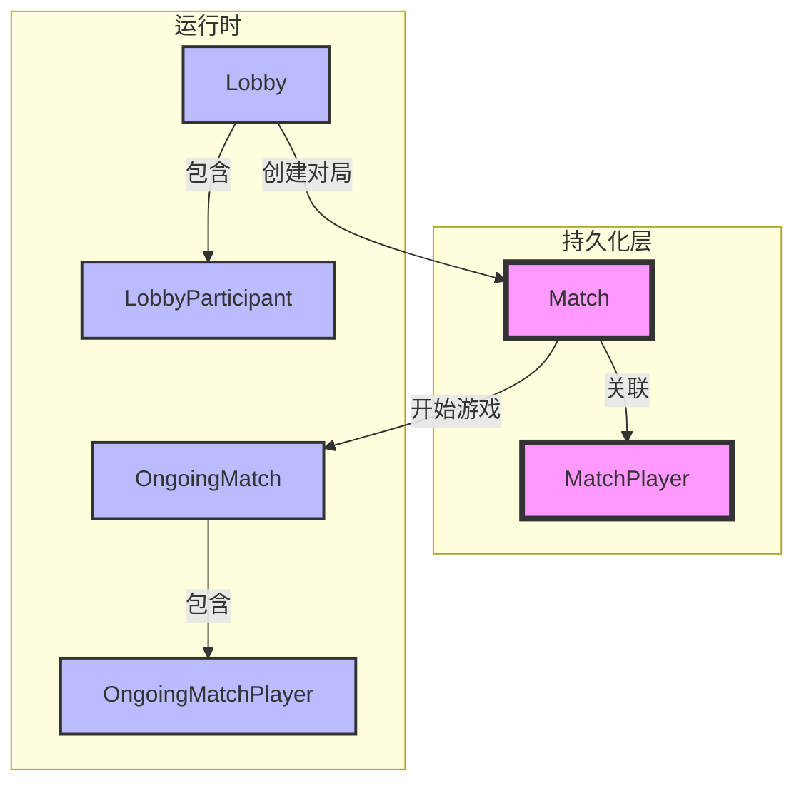

# Match Entities Module

## Module Overview

Match Entities模块定义了Exploding Kittens游戏中所有核心实体类。包括持久化实体(Match, MatchPlayer)和内存实体(OngoingMatch, Lobby等)。该模块是游戏状态管理的基础，处理对局数据的持久化和运行时数据的管理。

## Core Functionality

- **游戏状态管理**: 维护对局状态(Match)、玩家状态(MatchPlayer)和实时游戏数据(OngoingMatch)
- **大厅系统**: 处理游戏大厅(Lobby)和参与者(LobbyParticipant)的状态管理
- **数据持久化**: 通过TypeORM实现Match和MatchPlayer的数据库映射
- **实时游戏**: 在内存中维护OngoingMatch处理实时游戏逻辑
- **状态转换**: 处理从Lobby到Match、从Match到OngoingMatch的状态转换

## Key Components

### 持久化实体
- **match.entity.ts**: 对局基础信息，存储游戏类型、状态等
- **match-player.entity.ts**: 玩家游戏记录，包含胜负、积分变化等

### 运行时实体
- **ongoing-match.entity.ts**: 进行中的游戏状态，包含回合、卡牌等完整信息
- **ongoing-match-player.entity.ts**: 游戏中玩家状态，包含手牌等信息
- **lobby.entity.ts**: 游戏大厅，处理玩家匹配和游戏准备
- **lobby-participant.entity.ts**: 大厅参与者，定义玩家/观众角色

## Dependencies

### 内部依赖
- **@User**: 用户实体，关联玩家信息
- **lib/typings**: 游戏相关类型定义
- **lib/constants**: 游戏常量定义
- **lib/deck**: 卡牌系统定义

### 外部依赖
- **TypeORM**: 用于Match和MatchPlayer的数据库映射
- **class-validator**: 用于实体属性验证

## Usage Examples

```typescript
// 示例1: 创建新对局
const match = new Match();
match.id = "match_123";
match.type = "classic";
match.status = "ongoing";
await match.save();

// 示例2: 大厅参与者管理
const lobby = new Lobby({
  id: "lobby_456",
  participants: [],
  mode: { type: "classic", options: {} }
});
lobby.addParticipant({
  user: someUser,
  as: "player",
  role: "leader"
});
```

## Architecture Notes



关键设计说明:
1. 采用持久化与运行时实体分离的设计
2. Match/MatchPlayer使用TypeORM装饰器实现ORM映射
3. OngoingMatch维护完整游戏状态，支持实时更新
4. 所有实体类都实现了public getter用于数据过滤
5. Lobby作为临时对象管理匹配阶段的状态
