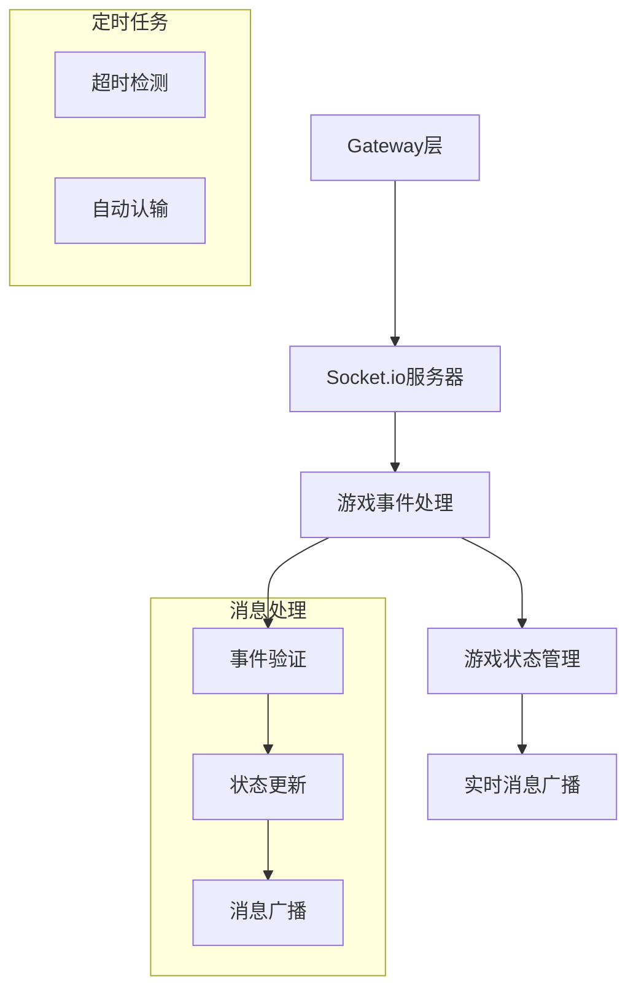

# Match Gateways Module

## Module Overview

Gateway模块是Exploding Kittens游戏的WebSocket通信层，负责处理实时游戏消息、状态同步和玩家操作。该模块实现了游戏的所有实时交互功能，包括匹配系统、对局管理和游戏操作处理。

## Core Functionality

- **房间管理**: 处理私人/公共房间的创建、加入、离开等操作
- **游戏状态同步**: 维护和同步游戏状态，包括回合、卡牌和玩家信息等
- **实时消息处理**: 处理玩家行为、游戏事件和状态更新的实时消息
- **匹配系统**: 实现公共对局的玩家匹配队列
- **超时处理**: 管理玩家行动超时和自动认输机制

## Key Components

### 核心网关
- **match.gateway.ts**: 游戏核心操作处理，包括出牌、抽牌等
- **public-match.gateway.ts**: 公共对局匹配和管理
- **private-match.gateway.ts**: 私人对局和游戏大厅管理

### Gateway Handler方法
- **handleCardAction**: 处理卡牌效果和连锁反应
- **handleDefeat**: 处理玩家失败逻辑
- **handleVictory**: 处理胜利结算
- **handleEnd**: 处理游戏结束清理

## Dependencies

### 内部依赖
- **@OngoingMatch**: 运行时游戏状态实体
- **@UserService**: 用户服务
- **@RedisService**: Redis缓存服务
- **lib/elo**: ELO分数计算
- **lib/events**: WebSocket事件定义

### 外部依赖
- **Socket.io**: WebSocket服务器实现
- **Bull**: 任务队列(超时处理)
- **class-validator**: DTO验证

## Usage Examples

```typescript
// 示例1: 处理玩家出牌
@SubscribeMessage(events.server.PLAY_CARD)
async playCard(@ConnectedSocket() socket: Socket, @MessageBody() dto: PlayCardDto) {
  const match = await this.ongoingMatchService.get(dto.matchId);
  // ... 验证游戏状态和玩家权限
  await this.handleCardAction({match, card: card.name, payload: dto.payload});
}

// 示例2: 匹配系统实现
@SubscribeMessage(events.server.JOIN_QUEUE)
async joinQueue(@ConnectedSocket() socket: Socket) {
  const user = socket.request.session.user;
  const queue = await this.redisService.get<Enqueued[]>(RP.QUEUE) || [];
  queue.push({id: user.id, at: Date.now()});
  // ... 处理匹配逻辑
}
```

## Architecture Notes



关键设计说明:
1. 使用WebSocket保持双向通信
2. 采用Bull队列处理超时
3. 实现观察者模式进行消息广播
4. 使用Redis缓存游戏状态
5. 分离公共和私人对局的处理逻辑
