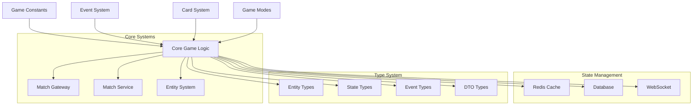

# Match Lib Module

## Module Overview

Match Lib模块是Exploding Kittens游戏的核心逻辑库。它实现了游戏的所有基础机制,包括:游戏规则定义、事件系统、卡牌机制、游戏模式和类型系统等。该模块是整个游戏系统的基石,为其他模块提供了必要的基础设施和工具。

## Core Functionality

- **游戏常量管理**: 集中管理所有游戏相关的常量定义,包括玩家限制、游戏状态、超时配置等
- **事件系统**: 基于Socket.io实现的全面事件系统,处理客户端-服务器间的实时通信
- **卡牌系统**: 复杂的卡牌生成和管理系统,包括洗牌算法、特殊卡牌效果等
- **游戏模式**: 支持多种游戏模式(经典、随机、核心等),每种模式都有独特规则配置
- **类型系统**: 完整的TypeScript类型定义,确保类型安全和代码可维护性
- **游戏状态管理**: 处理游戏进程中的各种状态转换和数据同步

## Key Components

### 常量定义 (constants.ts)
```typescript
// 玩家限制
MAX_NUMBER_OF_MATCH_PLAYERS = 10;
MIN_NUMBER_OF_MATCH_PLAYERS = 2;

// 游戏状态
MATCH_STATE = {
  DEK: "defuse-exploding-kitten",
  IEK: "insert-exploding-kitten",
  ATF: "alter-the-future",
  // ...more states
}

// 超时配置
QUEUE = {
  MATCHMAKING: { REPEAT: 5000 },
  CARD_ACTION: { DELAY: 5000 },
  INACTIVITY: {
    DELAY: {
      COMMON: 45000,
      DEFUSE: 10000
    }
  }
}
```

### 事件系统 (events.ts)
```typescript
events = {
  server: {
    // 玩家行为事件
    PLAY_CARD: "match:play-card",
    DRAW_CARD: "match:draw-card",
    
    // 游戏流程事件
    JOIN_MATCH: "match:join-match",
    LEAVE_MATCH: "match:leave-match",
    
    // 特殊卡牌事件
    DEFUSE_EXPLODING_KITTEN: "match:defuse-exploding-kitten",
    ALTER_FUTURE_CARDS: "match:alter-future-cards"
  },
  client: {
    // 状态更新事件
    STATE_CHANGE: "match:state-change",
    TURN_CHANGE: "match:turn-change",
    
    // 结果事件
    VICTORY: "match:victory",
    PLAYER_DEFEAT: "match:player-defeat"
  }
}
```

### 卡牌系统 (deck.ts)
- **卡牌生成**:
```typescript
deck.generate(players: number, options?: {
  exclude?: Card[],  // 排除的卡牌
  cards?: Card[]     // 使用特定卡牌集
}) => {
  individual: CardDetails[][],  // 每个玩家的初始手牌
  main: Card[]                 // 主牌堆
}
```

- **牌组规则**:
```typescript
playable = cards.filter(card => ![
  "exploding-kitten",
  "imploding-kitten-closed",
  "imploding-kitten-open"
].includes(card))
```

### 游戏模式 (modes.ts)
```typescript
LOBBY_MODE = {
  DEFAULT: deck.cards,                    // 所有卡牌
  CORE: ["exploding-kitten", "defuse"],  // 核心卡牌
  RATED: deck.cards.filter(/*...*/),     // 排位模式卡牌
}
```

### 类型定义 (typings.ts)
- **实体类型**:
```typescript
interface OngoingMatchData {
  id: string
  players: OngoingMatchPlayerData[]
  draw: Card[]
  discard: Card[]
  turn: number
  state: OngoingMatchState
  context: OngoingMatchContext
}
```

- **游戏状态**:
```typescript
interface OngoingMatchState {
  type: MatchStateType
  at: number
  payload?: any
}
```

## Dependencies

### 内部依赖
- **@User**: 用户实体和关系管理
- **@Redis**: 缓存服务,用于状态持久化
- **@Utils**: 通用工具函数库
- **@Types**: 共享类型定义
- **@Constants**: 全局常量定义

### 外部依赖
- **Socket.io**: WebSocket服务器实现
- **nanoid**: 生成唯一标识符
- **class-validator**: 数据验证
- **TypeORM**: 数据库交互
- **Bull**: 任务队列处理

## Architecture Notes



### 核心设计原则

1. **事件驱动架构**
   - 使用WebSocket实现实时通信
   - 事件统一命名和管理
   - 支持双向通信和广播

2. **状态管理**
   - 使用Redis缓存活跃游戏状态
   - 数据库持久化关键数据
   - 内存中维护实时状态

3. **类型系统**
   - 完整的TypeScript类型定义
   - DTO验证和转换
   - 实体关系映射

4. **可扩展性**
   - 模块化设计
   - 插件式游戏模式
   - 配置驱动的规则系统

5. **容错和恢复**
   - 断线重连支持
   - 状态自动恢复
   - 超时处理机制

## Usage Examples

### 1. 游戏初始化
```typescript
// 创建新游戏实例
const match = new OngoingMatch({
  id: nanoid(),
  players: generatePlayers(participants),
  draw: deck.generate(playerCount).main,
  state: { type: MATCH_STATE.WFA, at: Date.now() },
  context: { attacks: 0, noped: false, reversed: false }
});
```

### 2. 事件处理
```typescript
// 监听玩家行动
@SubscribeMessage(events.server.PLAY_CARD)
async handlePlayCard(socket: Socket, dto: PlayCardDto) {
  const match = await this.matchService.get(dto.matchId);
  await this.validateAction(match, socket.user, dto);
  await this.executeCardEffect(match, dto.card);
  this.broadcastState(match);
}
```

### 3. 状态同步
```typescript
// 广播状态更新
this.server.to(match.id).emit(events.client.STATE_CHANGE, {
  state: match.state,
  context: match.context,
  turn: match.turn
});
```

### 4. 游戏模式配置
```typescript
const gameMode = {
  type: "custom",
  payload: {
    disabled: ["catomic-bomb", "personal-attack"],
    initialCards: 7,
    timeLimit: 30000
  }
};
```

## Performance Considerations

1. **内存管理**
   - 及时清理结束的游戏
   - 使用Redis缓存活跃游戏
   - 定期垃圾回收

2. **网络优化**
   - 最小化事件payload
   - 批量更新
   - 压缩WebSocket数据

3. **并发处理**
   - 使用队列处理卡牌效果
   - 原子性状态更新
   - 事务管理
