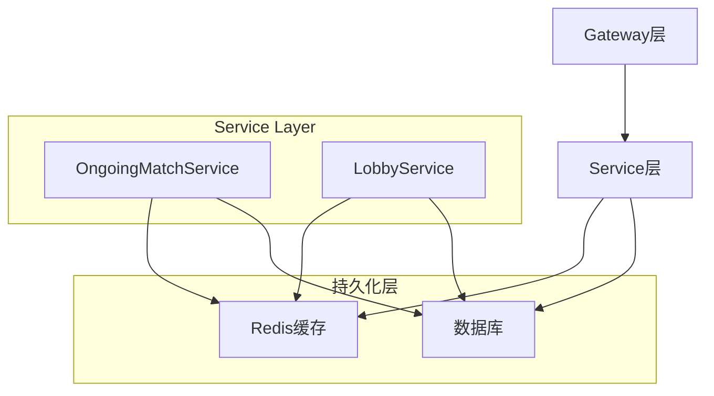

# Match Services Module

## Module Overview

Match Services模块提供了游戏服务层的核心实现，包括游戏大厅(Lobby)和进行中游戏(OngoingMatch)的状态管理。该模块负责处理游戏数据的持久化、缓存和实时更新，是连接数据层和网关层的重要桥梁。

## Core Functionality

- **实时游戏状态管理**: 通过Redis维护OngoingMatch的完整游戏状态
- **大厅系统服务**: 处理游戏大厅的创建、更新和销毁
- **数据持久化**: 管理游戏数据在Redis和数据库间的同步
- **状态一致性**: 确保分布式系统中游戏状态的一致性
- **性能优化**: 实现高效的缓存策略和数据访问模式

## Key Components

### OngoingMatchService
```typescript
interface IOngoingMatchService {
  get(id: string): Promise<OngoingMatch | null>;   // 获取进行中的游戏
  save(match: OngoingMatch): Promise<void>;        // 保存游戏状态
  update(id: string, data: Partial<OngoingMatchData>): Promise<void>; // 更新游戏状态
  delete(id: string): Promise<void>;               // 删除游戏状态
}
```

### LobbyService
```typescript
interface ILobbyService {
  get(id: string): Promise<Lobby | null>;          // 获取大厅信息
  save(lobby: Lobby): Promise<void>;               // 保存大厅状态
  delete(id: string): Promise<void>;               // 删除大厅
  update(id: string, data: Partial<LobbyData>): Promise<void>; // 更新大厅信息
}
```

## Dependencies

### 内部依赖
- **@Redis**: Redis缓存服务
- **@TypeORM**: 数据库服务
- **@Entities**: 实体定义
- **@Types**: 类型定义
- **@Constants**: 常量定义

### 外部依赖
- **Redis**: 分布式缓存
- **PostgreSQL**: 关系型数据库
- **class-transformer**: 对象序列化
- **class-validator**: 数据验证

## Architecture Notes



### 设计原则

1. **缓存策略**
   - 使用Redis存储活跃游戏状态
   - 实现高效的缓存更新机制
   - 合理的缓存过期策略

2. **数据一致性**
   - 原子性操作保证
   - 事务管理
   - 乐观锁控制并发

3. **性能优化**
   - 批量操作优化
   - 延迟加载
   - 查询缓存

4. **错误处理**
   - 优雅降级
   - 重试机制
   - 日志记录

## Usage Examples

### 1. 管理游戏状态
```typescript
// 获取并更新游戏状态
const match = await this.ongoingMatchService.get(matchId);
if (match) {
  match.addPlayer(newPlayer);
  await this.ongoingMatchService.save(match);
}
```

### 2. 大厅管理
```typescript
// 创建新大厅
const lobby = new Lobby({
  id: nanoid(),
  participants: [leader],
  mode: { type: "classic" }
});
await this.lobbyService.save(lobby);
```

### 3. 状态同步
```typescript
// 游戏状态更新
async updateGameState(matchId: string, update: Partial<OngoingMatchData>) {
  const match = await this.ongoingMatchService.get(matchId);
  if (!match) return;
  
  Object.assign(match, update);
  await this.ongoingMatchService.save(match);
  return match;
}
```

## Performance Considerations

1. **缓存优化**
   - 使用合适的Redis数据结构
   - 实现多层缓存策略
   - 定期清理过期数据

2. **数据库优化**
   - 索引优化
   - 连接池管理
   - 查询优化

3. **并发处理**
   - 分布式锁
   - 队列处理
   - 状态同步

4. **监控和日志**
   - 性能指标监控
   - 错误追踪
   - 访问日志
