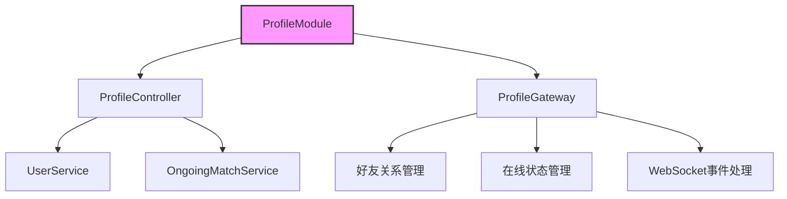

# 用户档案模块

## 模块概述

Profile模块处理用户的个人资料、游戏统计、好友关系和实时状态管理。该模块提供了HTTP和WebSocket两种接口，支持用户档案查询和社交关系管理。

## 核心功能

- **用户档案管理**: 查询用户基本信息和游戏统计
- **好友系统**: 完整的好友关系管理（添加、接受、拒绝、撤销、删除）
- **在线状态**: 实时监控和广播用户在线状态
- **游戏记录**: 查询用户历史对局和正在进行的游戏
- **社交互动**: 支持用户封禁和解封功能

## 关键组件

### 主要文件
- **profile.controller.ts**: HTTP接口控制器
- **profile.gateway.ts**: WebSocket网关
- **profile.module.ts**: 模块配置和依赖注入

### 数据传输对象(DTOs)
- **accept-friend-request.dto.ts**: 接受好友请求
- **send-friend-request.dto.ts**: 发送好友请求
- **block.dto.ts**: 封禁用户
- **unfriend.dto.ts**: 删除好友

## WebSocket事件

### 服务器事件
```typescript
{
  SEND_FRIEND_REQUEST: "user:send-friend-request",
  REVOKE_FRIEND_REQUEST: "user:revoke-friend-request",
  ACCEPT_FRIEND_REQUEST: "user:accept-friend-request",
  REJECT_FRIEND_REQUEST: "user:reject-friend-request",
  UNFRIEND: "user:unfriend",
  BLOCK: "user:block",
  UNBLOCK: "user:unblock"
}
```

### 客户端事件
```typescript
{
  ONLINE: "user:online",
  OFFLINE: "user:offline",
  FRIEND_REQUEST_RECEIVED: "user:friend-request-received",
  FRIEND_REQUEST_ACCEPTED: "user:friend-request-accepted",
  FRIEND_REQUEST_REJECTED: "user:friend-request-rejected",
  FRIEND_REQUEST_REVOKED: "user:friend-request-revoked",
  UNFRIENDED: "user:unfriended"
}
```

## HTTP接口

### 个人档案接口
- `GET /profile/me`: 获取个人信息
- `GET /profile/me/stats`: 获取个人统计数据
- `GET /profile/me/matches`: 获取个人对局历史
- `GET /profile/me/friends`: 获取好友列表
- `GET /profile/me/matches/ongoing`: 获取进行中的对局

### 用户查询接口
- `GET /profile/:username`: 获取指定用户信息
- `GET /profile/:username/stats`: 获取用户统计数据
- `GET /profile/:username/matches`: 获取用户对局历史
- `GET /profile/:username/friends`: 获取用户好友列表
- `GET /profile/:username/matches/ongoing`: 获取用户进行中的对局

## 架构说明



### 用户统计数据结构

```typescript
interface UserStats {
  won: number;      // 胜场
  lost: number;     // 负场
  played: number;   // 总场次
  winrate: number;  // 胜率
  rating: number;   // 评分
}
```

### 社交关系状态

- NONE: 无关系
- FRIENDS: 好友
- FRIEND_REQ_1_2: 用户1向用户2发送好友请求
- FRIEND_REQ_2_1: 用户2向用户1发送好友请求
- BLOCKED: 互相封禁
- BLOCKED_1_2: 用户1封禁用户2
- BLOCKED_2_1: 用户2封禁用户1

本模块通过与UserModule和MatchModule的紧密集成，提供了完整的用户档案和社交功能支持。
