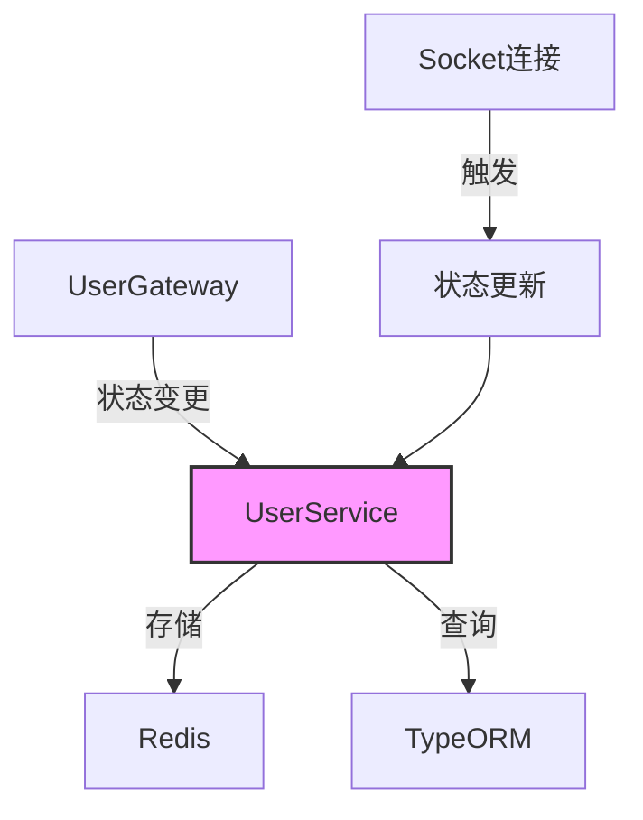

# 用户模块

## 模块概述

用户模块是Exploding Cats GameFi的核心基础模块，负责以下职责：
1. 用户实体的持久化存储和管理
2. 用户关系系统的维护(好友、封禁等)
3. 用户实时状态追踪(在线、游戏中等)
4. 提供统一的用户数据访问接口

## 核心功能

### 用户实体管理
- **基础信息**: ID、用户名、密码、头像URL
- **游戏数据**: 评分(rating)系统
- **实体关系**: 与MatchPlayer、Relationship等实体的关联
- **数据验证**: 用户名格式、密码强度等验证

### 状态管理
- **在线状态**: online/offline状态追踪
- **活动状态**: 游戏中、大厅中、观战中
- **实时更新**: 通过Redis实现状态实时同步
- **状态广播**: WebSocket实现状态变更通知

### 用户关系系统
- **好友关系**: 双向好友关系管理
- **请求处理**: 发送、接受、拒绝好友请求
- **封禁系统**: 用户互相封禁功能
- **关系状态**: 支持复杂的状态转换

## 详细组件说明

### 实体定义
- **User实体**:
  ```typescript
  @Entity()
  export class User extends BaseEntity {
    @PrimaryGeneratedColumn("uuid")
    id: string;
    
    @Column()
    username: string;
    
    @Column()
    password: string;
    
    @Column()
    avatar: string;
    
    @Column({default: 1000})
    rating: number;
  }
  ```

- **Relationship实体**:
  ```typescript
  @Entity()
  export class Relationship extends BaseEntity {
    @ManyToOne(() => User)
    user1: User;
    
    @ManyToOne(() => User)
    user2: User;
    
    @Column()
    status: number;
  }
  ```

### 服务层实现

#### UserService
提供以下核心功能：
- getSupplemental(): 获取用户补充信息
- getInterim(): 获取用户临时状态
- setInterim(): 更新用户临时状态

### WebSocket接口

#### 事件定义
```typescript
const events = {
  server: {
    GET_SUPPLEMENTAL: "user:get-supplemental"
  }
};
```

#### UserGateway
处理用户相关的WebSocket事件：
- 获取用户补充信息
- 状态变更通知
- 在线状态同步

## 数据结构

### 用户状态类型
```typescript
interface UserSupplemental {
  status: "online" | "offline";
  activity: {
    type: "in-lobby" | "in-match" | "spectate";
    matchId?: string;
    lobbyId?: string;
  } | null;
}
```

### 关系状态定义
```typescript
enum RELATIONSHIP_STATUS {
  NONE = 3,
  FRIENDS = 2,
  FRIEND_REQ_1_2 = 0,
  FRIEND_REQ_2_1 = 1,
  BLOCKED = -1,
  BLOCKED_1_2 = -2,
  BLOCKED_2_1 = -3
}
```

## 技术实现

### 状态管理架构


### Redis存储结构
- 键格式: `user:{userId}`
- 值格式: JSON存储的UserInterim对象
```typescript
{
  status: "online" | "offline",
  activity: {
    type: string,
    matchId?: string,
    lobbyId?: string
  }
}
```

### 性能优化

1. **数据库优化**:
   - 用户名索引优化
   - 关系查询优化
   - 实体关系懒加载

2. **缓存策略**:
   - Redis状态缓存
   - 临时数据TTL控制
   - 批量状态查询优化

3. **WebSocket优化**:
   - 状态广播限流
   - 连接池管理
   - 断线重连处理

## 应用示例

```typescript
// 获取用户补充信息
const supplemental = await userService.getSupplemental(userId);

// 更新用户状态
await userService.setInterim(userId, {
  status: "online",
  activity: {
    type: "in-match",
    matchId: "match-123"
  }
});

// WebSocket订阅用户状态
socket.on("user:online", ({userId}) => {
  // 处理用户上线事件
});
```

## 配置项

### TypeORM配置
```typescript
TypeOrmModule.forFeature([User, Relationship])
```

### 模块导出
```typescript
@Module({
  imports: [TypeOrmModule.forFeature([User, Relationship])],
  providers: [UserService, UserGateway],
  exports: [UserService],
})
export class UserModule {}
