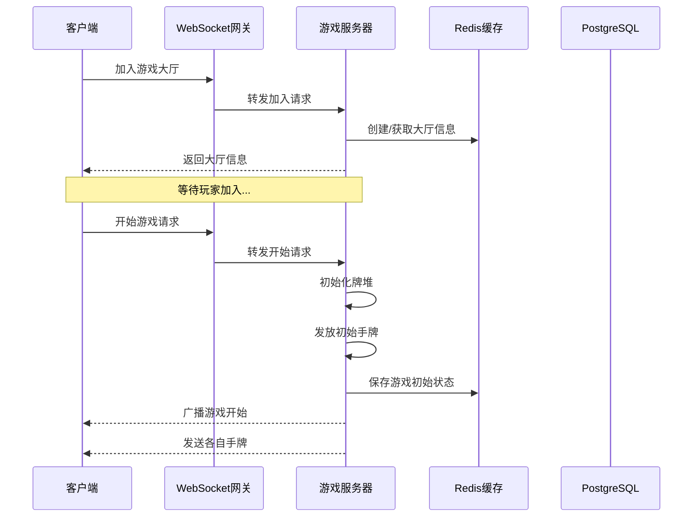
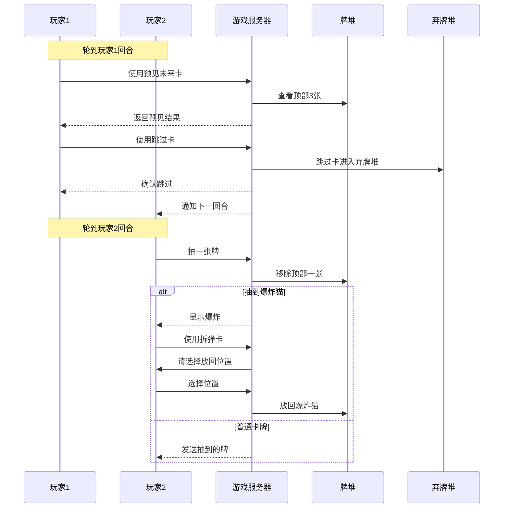
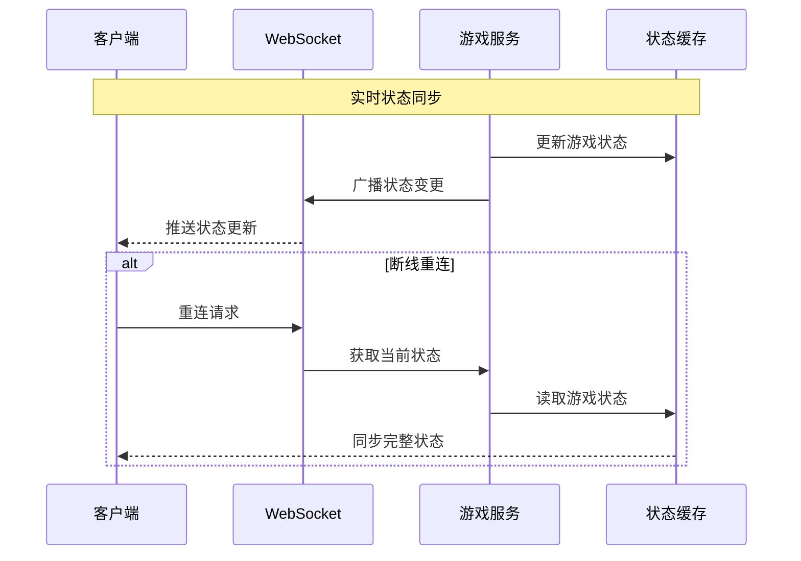
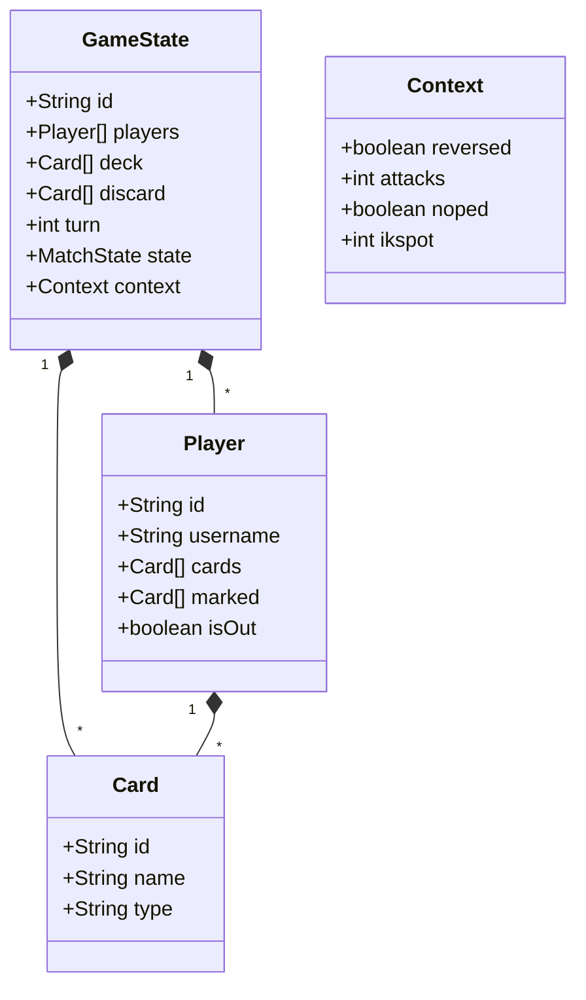
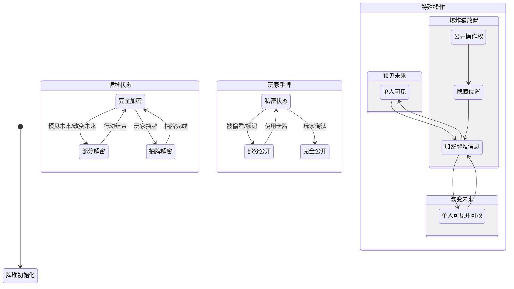
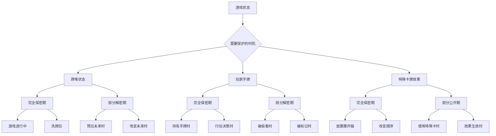
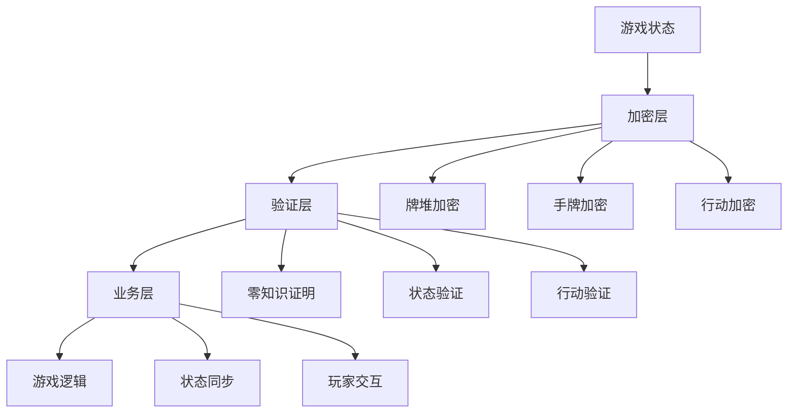

# 炸弹猫(Exploding Kittens)游戏逻辑说明

## 一、游戏目标
- 在所有玩家中存活到最后的玩家获胜
- 如果抽到爆炸猫卡且没有拆弹卡,玩家立即淘汰
- 需要通过各种功能卡或者行动卡来增加自己的生存机会

## 二、核心卡牌类型

### 1. 基础卡牌
- **爆炸猫卡(Exploding Kitten)**
  - 抽到即爆炸
  - 必须使用拆弹卡化解
  - 否则玩家立即淘汰

- **拆弹卡(Defuse)**
  - 用于拆除爆炸猫
  - 使用后可以将爆炸猫放回牌堆任意位置
  - 游戏开始时每人发1张

### 2. 行动卡牌
- **预见未来(See the Future)**
  - 查看牌堆顶部3张牌
  - 不改变牌堆的顺序

- **改变未来(Alter the Future)**
  - 查看并重新排列牌堆顶部3张牌

- **跳过(Skip)**
  - 结束当前回合而不抽牌
  - 下一位玩家继续

- **攻击(Attack)**
  - 结束当前回合而不抽牌
  - 下一位玩家必须连续进行2个回合
  - 升级:指定任意玩家,移除行动功能

- **打乱(Shuffle)**
  - 随机打乱整个牌堆

- **偷看(Mark)**
  - 查看其他玩家的一张手牌

- **反转(Reverse)**
  - 改变游戏进行方向
  - 顺时针变逆时针,反之亦然
  - 升级:转为行动卡

- **植入(Bury)**
  - 将一张手牌放入牌堆任意位置

## 三、游戏流程

### 1. 游戏准备
1. 根据玩家人数准备相应数量的爆炸猫卡(玩家人数-1)
2. 每人发1张拆弹卡
3. 洗牌并发给每人4张基础牌
4. 将爆炸猫卡洗入剩余牌堆

### 2. 回合流程
1. 玩家可以使用任意数量的手牌
2. 回合结束时必须抽一张牌,除非:
   - 使用跳过卡
   - 使用攻击卡
   - 上述卡牌可以结束当前回合可以称为具有行动功能的行动卡,但是行动功能只是行动卡的附属功能
3. 如果抽到爆炸猫:
   - 有拆弹卡则可以存活
   - 无拆弹卡则淘汰

### 3. 特殊规则
- 可以任意使用功能卡组合
- 某些卡牌可以影响游戏顺序
- 爆炸后的玩家所有手牌弃置

## 四、游戏交互流程

### 1. 游戏开局流程

### 2. 游戏进行流程

### 3. 状态同步流程

### 4. 关键状态数据结构

## 五、关键状态变化
1. **回合状态**
   - waiting-for-action: 等待玩家行动
   - defuse-exploding-kitten: 等待拆弹
   - insert-exploding-kitten: 放回爆炸猫
   - alter-the-future: 改变未来
   - share-the-future: 分享未来视

2. **游戏上下文**
   - 玩家回合
   - 攻击次数
   - 游戏方向
   - 特殊卡牌位置

## 六、游戏隐私保护需求

### 1. 核心隐私数据与状态转换

### 2. 隐私保护时机表

### 3. 关键隐私保护点

1. **牌堆信息(持续性保护)**
   - 保护内容：
     * 牌堆顺序
     * 特定位置的卡牌
     * 剩余卡牌数量统计
   - 解密条件：
     * 抽牌时对当前玩家解密
     * 使用预见未来时临时解密
     * 游戏结束时全部解密

2. **玩家手牌(选择性保护)**
   - 保护内容：
     * 持有的卡牌类型
     * 获得卡牌的顺序
   - 解密条件：
     * 被偷看时向特定玩家解密
     * 使用卡牌时公开
     * 被标记时部分公开
     * 淘汰时完全公开

3. **特殊卡牌效果(临时性保护)**
   - 保护内容：
     * 预见未来的信息
     * 改变未来的新顺序
     * 爆炸猫的放置位置
   - 解密条件：
     * 效果目标玩家可见
     * 效果触发时解密
     * 效果结束后重新加密

4. **玩家行动(实时性保护)**
   - 保护内容：
     * 行动选择
     * 目标选择
     * 连锁反应决策
   - 解密条件：
     * 行动提交后公开
     * 效果生效时公开
     * 回合结束时全部公开

### 4. 信息保护责任链

这些隐私保护机制需要确保:
1. 游戏公平性
2. 数据隐私性
3. 操作不可否认性
4. 状态可验证性

在迁移到Web3时,这些保护机制需要通过零知识证明、同态加密等密码学工具来实现。
